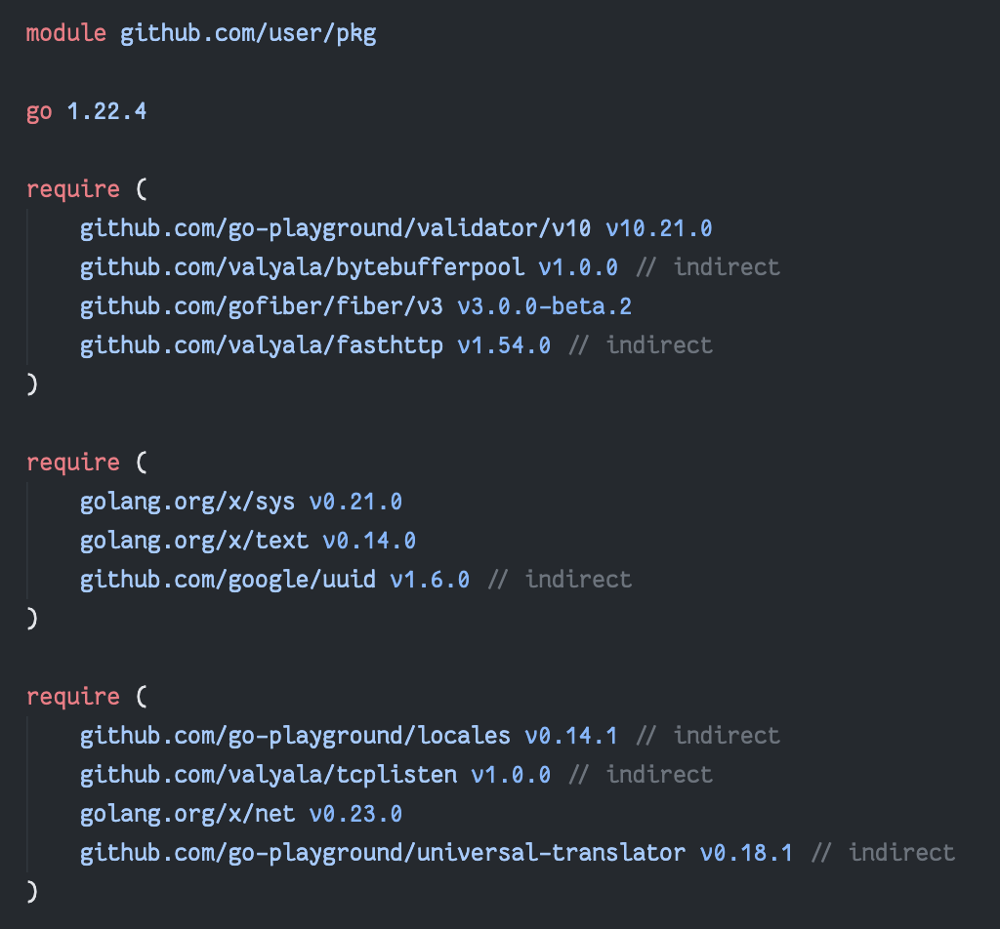

# `modmerge`

This tool merges require blocks in `go.mod` files since [`go mod tidy` doesn't do it](https://github.com/golang/go/issues/56471).

<table>
<tr>
    <th> Before </th>
    <th> After </th>
</tr>
<tr>
    <td></td>
    <td></td>
</tr>
</table>

## Installation

```sh
go install go.abhijithota.me/modmerge@latest
```

## Usage

The binary outputs the formatted `go.mod` to standard output. In your Go project root, run:

```sh
modmerge > go.mod
```

## Limitations

I hacked this tool together using the official parser in less than 2 hours and unsurprisingly there are a few drawbacks with this:

- `require` blocks come last after using this. Can be fixed with little effort I think?
- Comments in `require` blocks are not preserved.
