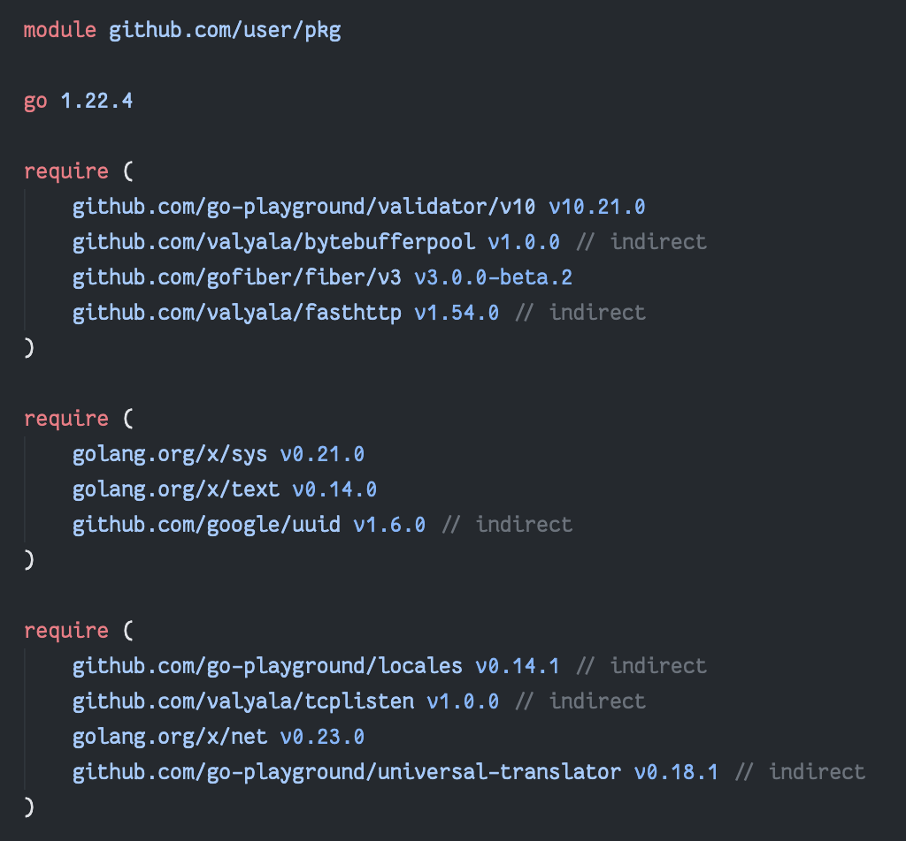
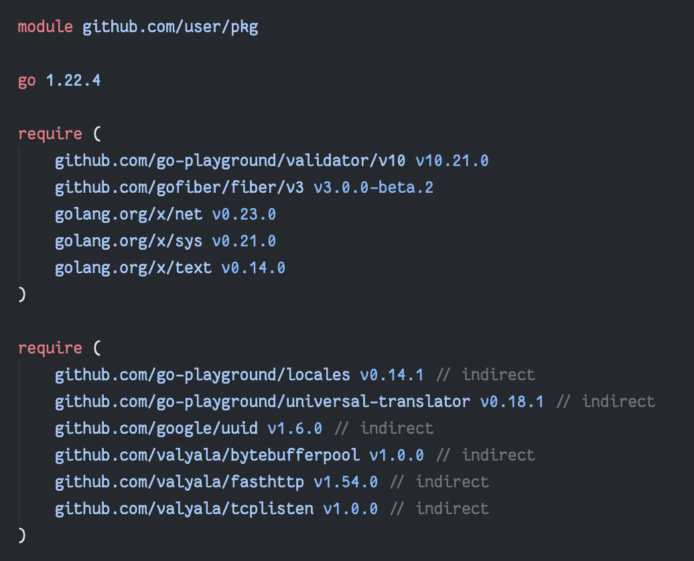

# `modfmt`

This tool merges require blocks in `go.mod` files since [`go mod tidy` doesn't do it](https://github.com/golang/go/issues/56471). 
It also separates the direct and indirect dependencies and sorts them alphabetically.

| Before                       | After                       |
|------------------------------|-----------------------------|
|  |  |

## Installation

```sh
go install github.com/abhijit-hota/modfmt@latest
```

## Usage

The binary outputs the formatted `go.mod` to standard output.

Alternatively, you can use the `--in-place` flag to replace the contents of the `go.mod` file in place.

In your Go project root, run:
```sh
modfmt --in-place
```

## Limitations

I hacked this tool together using the official parser in less than 2 hours and unsurprisingly there are a few drawbacks with this:

- `require` blocks come last after using this. Can be fixed with little effort I think?
- Comments in `require` blocks are not preserved.
